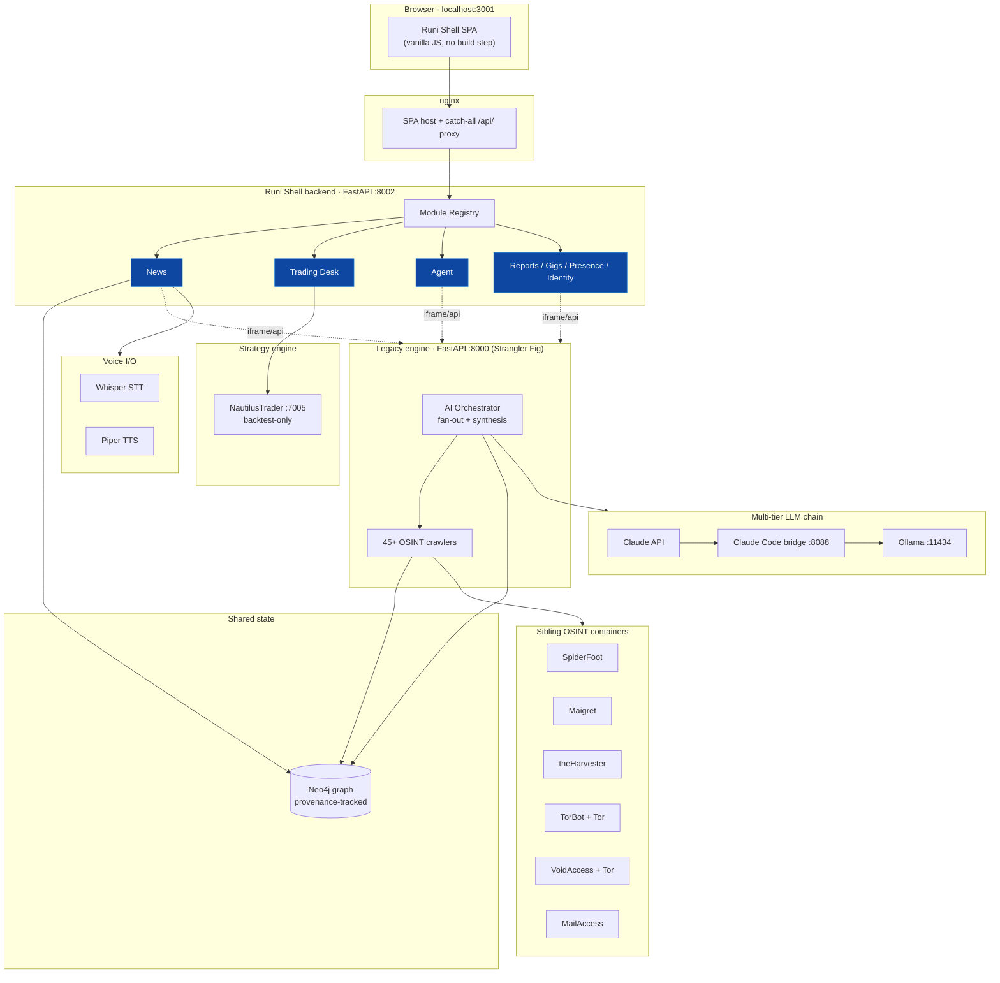
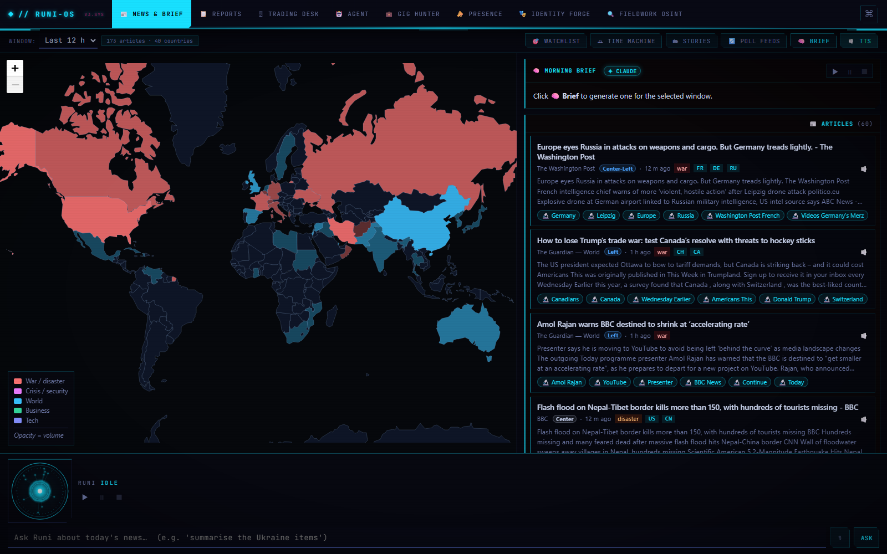
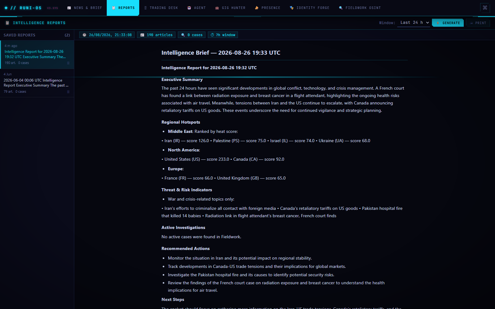
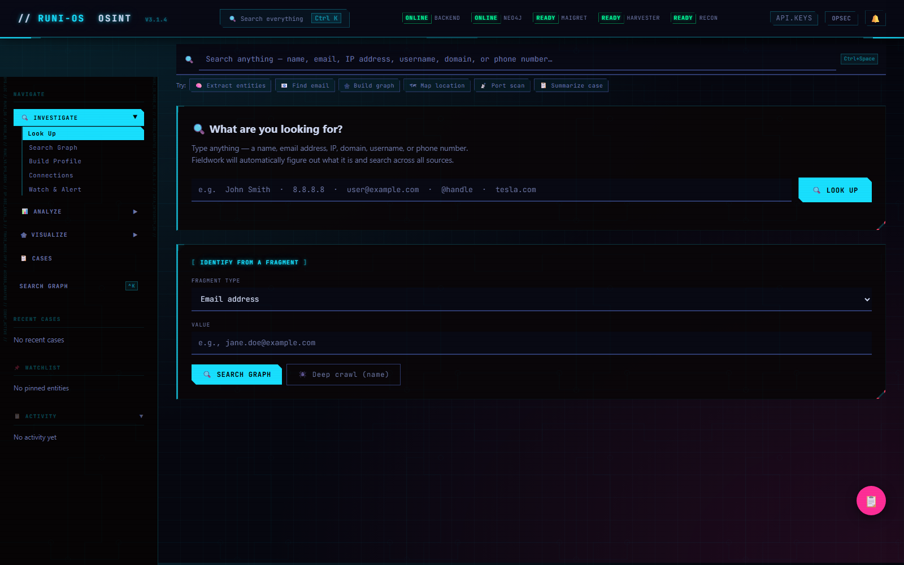
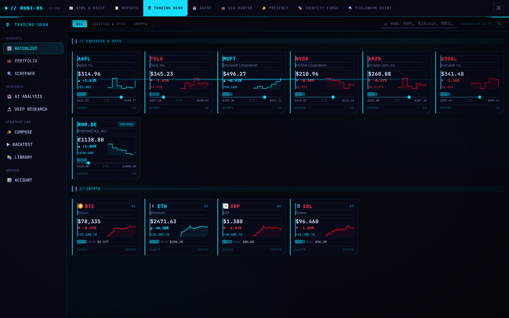

# Runi-OS

**A modular, self-hosted OSINT & personal-intelligence platform** — 45+ enrichment sources fused into one provenance-tracked graph, an autonomous AI investigation engine, and a modular dashboard, all running as a single `docker compose up`.

<p>


</p>

> **Design intent:** single-operator, **localhost-only**, no auth by design — every port binds `127.0.0.1`. This is a portfolio-grade engineering showcase, not a hosted service. Use only for authorized research on data you have the right to process.

---

## Why it exists

Most OSINT work means juggling a dozen disconnected tools and hand-copying results between them. Runi-OS collapses that into **one graph**: every source writes into a shared Neo4j instance with full provenance (which tool, when, how confident), and an AI orchestrator fans a single target out across the whole toolset and writes back a synthesized brief.

It's also a live demonstration of a **Strangler Fig migration** — a legacy monolith is being incrementally absorbed, module by module, into a modern modular shell, with both generations running side by side in the same stack.

---

## Architecture



**16-container Docker Compose stack**, all bound to `127.0.0.1`:

| Layer | Services |
|---|---|
| **Graph & state** | Neo4j (single shared datastore, provenance on every edge) |
| **Backends** | Runi Shell API `:8002` · Legacy engine API `:8000` |
| **Frontends** | Shell SPA `:3001` (nginx) · Legacy SPA `:3000` |
| **OSINT tools** | SpiderFoot · Maigret · theHarvester · TorBot (+Tor) · VoidAccess (+Tor) · MailAccess |
| **AI / LLM** | Claude API → Claude Code bridge → Ollama (local `llama3.2` fallback) |
| **Voice** | Whisper (STT) · Piper (TTS) |
| **Strategy** | NautilusTrader backtest engine `:7005` |

---

## Feature highlights

- **🕸 Unified investigation graph** — 45+ enrichment crawlers (email, domain, IP, username, phone, company, crypto) write into one Neo4j instance. Every node and relationship records its `source`, `confidence`, and `found_at`, so a finding can always be traced back to the tool that produced it.
- **🤖 Autonomous AI orchestration** — give it one target; it auto-detects the type, fans out concurrently across the relevant tools, tracks a per-source **coverage** map (`data / no_findings / blind / failed`), runs a **relevance gate** so keyword noise can't be laundered as fact, and has Claude synthesize a cited intelligence brief.
- **🔗 Multi-tier LLM chain** — Claude API → a Claude Code CLI bridge → local Ollama, so every AI feature degrades gracefully and works with or without an API key.
- **📰 News & brief module** — RSS ingest from ~11 sources → geocoded choropleth world map, embedding-based topic clustering, media-bias/ownership analysis, an LLM morning brief, and a voice Q&A assistant.
- **🖥 Trading Desk** — plain-English → NautilusTrader strategy, backtested on live market data, with a shared canvas charting helper. **Execution is walled off** — the broker view is strictly read-only.
- **🧩 Modular shell** — add a feature as a self-contained module (backend package + one frontend manifest); the nginx catch-all proxy means no config change is ever needed to expose a new route.
- **🔒 Local-first & CDN-free** — both frontends vendor every asset (maps, fonts, graph libs); nothing loads from a third-party host at runtime.

---

## Screenshots

**News & Brief** — geocoded choropleth world map, media-bias-tagged article stream, and an LLM morning brief.


**Intelligence Brief** — the Reports module synthesizes News + graph data into a cited, structured brief (hotspots, threat indicators, recommended actions).


**OSINT investigation dashboard** — one search bar over 45+ sources; auto-detects name / email / IP / domain / username / phone.


**Trading Desk** — markets, research, and a plain-English → NautilusTrader strategy lab in one module (broker view read-only).


> Still to add (see [`docs/DEMO.md`](docs/DEMO.md)): the Neo4j network-graph view with a multi-hop entity cluster (needs an investigation run to populate the graph first).

---

## Quick start

```bash
# 1. Clone and configure
git clone https://github.com/<you>/runi-os.git
cd runi-os
cp .env.example .env
# generate a Neo4j password and paste it into .env:
openssl rand -hex 24

# 2. (Optional) add free OSINT API keys to un-blind more crawlers
#    e.g. GITHUB_TOKEN, SHODAN_API_KEY — see docs/api-keys.md
#    Leave blank to run with the always-on sources only.

# 3. Bring up the whole stack
docker compose up --build
```

Then open **http://localhost:3001**.

- Shell API docs: `http://localhost:8002/docs`
- Legacy engine API: `http://localhost:8000`
- Neo4j browser: `http://localhost:7474`

First boot pulls the Ollama model and builds SpiderFoot from source, so allow a few minutes.

---

## How it compares

| | Maltego | SpiderFoot | **Runi-OS** |
|---|:---:|:---:|:---:|
| Self-hosted, no per-seat license | ◐ | ✓ | ✓ |
| Unified provenance graph | ✓ | ◐ | ✓ |
| **AI synthesis of findings into a brief** | ✗ | ✗ | ✓ |
| Local LLM fallback (offline-capable) | ✗ | ✗ | ✓ |
| Extensible module system | ◐ | ✓ | ✓ |
| One-command stand-up | ✗ | ◐ | ✓ |

Runi-OS doesn't replace scanners like SpiderFoot — it **orchestrates** them and adds the reasoning layer on top.

---

## Tech stack

**Backend:** Python 3.11, FastAPI (async), httpx, APScheduler · **Graph:** Neo4j 5 (+ APOC) · **AI:** Anthropic Claude, Ollama, embedding-based topic classification · **Frontend:** vanilla JS SPA (no build step), Leaflet, Cytoscape, Canvas charts · **Infra:** Docker Compose (16 services), nginx · **Domain tools:** SpiderFoot, Maigret, theHarvester, TorBot, VoidAccess, NautilusTrader, Whisper, Piper.

---

## Security & scope

Runi-OS is built for a **single operator on localhost** and ships **without authentication on purpose**. Do **not** expose it to a public network without adding an auth layer, TLS, and rate limiting. It is intended for **authorized** research and investigation on data you are legally permitted to process.

## License

MIT — see [LICENSE](LICENSE).
